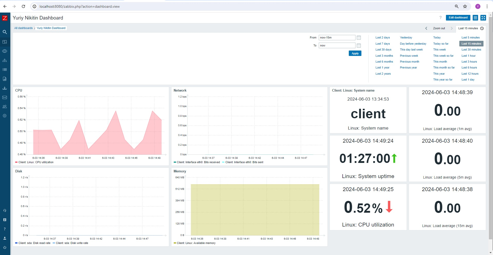

# Otus Homework 14. Monitoring
### Цель домашнего задания
Научиться настраивать Dashboard
### Описание домашнего задания
Настроить dashboard на одной из систем:
- zabbix (использовать screen (комплексный экран)
- prometheus - grafana
  
Dashboard должен соджержать 4 графика:
- память
- процессор
- диск
- сеть

## Выполнение
Для выполнения домашнего задания с помощью *Vagrant* развернут тестовые стенд из двух виртуальных машин:
- Server (192.168.88.10)
- Client (192.168.88.11)
### Prometheus
На ВМ Server установим Prometheus и Grafana, а на ВМ Client установим Node Exporter

#### Установка Prometheus
```bash
wget https://github.com/prometheus/prometheus/releases/download/v2.52.0/prometheus-2.52.0.linux-amd64.tar.gz
useradd --no-create-home --shell /bin/false prometheus
mkdir /etc/prometheus
mkdir /var/lib/prometheus
chown prometheus:prometheus /etc/prometheus
chown prometheus:prometheus /var/lib/prometheus
tar -xvzf prometheus-*
mv prometheus-* prometheuspackage
cp prometheuspackage/prometheus /usr/local/bin/
cp prometheuspackage/promtool /usr/local/bin/
chown prometheus:prometheus /usr/local/bin/prometheus
chown prometheus:prometheus /usr/local/bin/promtool
cp -r prometheuspackage/consoles /etc/prometheus
cp -r prometheuspackage/console_libraries /etc/prometheus
chown -R prometheus:prometheus /etc/prometheus/consoles
chown -R prometheus:prometheus /etc/prometheus/console_libraries
```
Конфиграционный файл Prometheus:
```yml
global:
  scrape_interval: 10s
scrape_configs:
  - job_name: 'prometheus_master'
    scrape_interval: 5s
    static_configs:
      - targets: ['localhost:9090']
  - job_name: 'node_exporter'
    scrape_interval: 5s
    static_configs:
     - targets: [ 192.168.88.11:9100 ]
```
Создаем сервис */etc/systemd/system/prometheus.service*:
```vim
[Unit]
Description=Prometheus
Wants=network-online.target
After=network-online.target
[Service]
User=prometheus
Group=prometheus
Type=simple
ExecStart=/usr/local/bin/prometheus \
--config.file /etc/prometheus/prometheus.yml \
--storage.tsdb.path /var/lib/prometheus/ \
--web.console.templates=/etc/prometheus/consoles \
--web.console.libraries=/etc/prometheus/console_libraries
[Install]
WantedBy=multi-user.target
```
Запускаем сервер:
```bash
systemctl daemon-reload
systemctl start prometheus
systemctl status prometheus
```
#### Установка Node Exporter
```bash
wget https://github.com/prometheus/node_exporter/releases/download/v1.8.1/node_exporter-1.8.1.linux-amd64.tar.gz	 
tar xzfv node_exporter-1.8.1.linux-amd64.tar.gz
useradd -rs /bin/false nodeusr
mv node_exporter-1.8.1.linux-amd64/node_exporter /usr/local/bin/
```
Создаем сервис */etc/systemd/system/node_exporter.service*:
```vim
[Unit]
Description=Node Exporter
After=network.target
[Service]
User=nodeusr
Group=nodeusr
Type=simple
ExecStart=/usr/local/bin/node_exporter
[Install]
WantedBy=multi-user.target
```
И запускаем его:
```bash
systemctl daemon-reload
systemctl start node_exporter
systemctl enable node_exporter
```
#### Установка Grafana
Используя *VPN*, скачиваем .deb пакет Grafana, устанавливаем на сервер и запускаем:
```bash
dpkg -i grafana-enterprise_11.0.0_amd64.deb
apt -f install
systemctl daemon-reload
systemctl start grafana-server.service
```

В результате мы получим сервер с установленными Prometheus и Grafana, и клиент с Node Exporter

<table>
  <tr>
    <td>
      
    </td>
    <td>
      
    </td>
  </tr>
  <tr>
    <td>
      
    </td>
    <td>
      
    </td>
  </tr>
</table>

Для выполнения задания будем использовать готовый дэшборд **Node Exporter Full**. Он покрывает поставленные задачи мониторинга:  
  


### Zabbix
Дополнительно установим Zabbix на сервер и Zabbix Agent на клиент. Будем использовать *nginx* в качестве веб-сервера и базу данных *MaridDB*.

#### Установка Zabbix Server
```bash
wget https://repo.zabbix.com/zabbix/6.4/ubuntu/pool/main/z/zabbix-release/zabbix-release_6.4-1+ubuntu22.04_all.deb
dpkg -i zabbix-release_6.4-1+ubuntu22.04_all.deb
apt update
apt install zabbix-server-mysql zabbix-frontend-php zabbix-nginx-conf zabbix-sql-scripts zabbix-agent mariadb-server
systemctl start mariadb.service

mysql -uroot
  mysql> create database zabbix character set utf8 collate utf8_bin;
  mysql> create user zabbix@localhost identified by 'password';
  mysql> grant all privileges on zabbix.* to zabbix@localhost;
  mysql> set global log_bin_trust_function_creators = 1;
  mysql> quit;

zcat /usr/share/doc/zabbix-server-mysql*/create.sql.gz | mysql -uzabbix -p zabbix
mysql -uroot
  mysql> set global log_bin_trust_function_creators = 0;
  mysql> quit;
```
В конфигурационный файл сервера */etc/zabbix/zabbix_server.conf* пропишем пароль для базы данных
```
DBPassword=password
```
Раскомментируем строки в файле */etc/zabbix/nginx.conf*
```
# listen 8080;
# server_name example.com;
```
Запустим сервисы:
```
systemctl restart zabbix-server zabbix-agent nginx php8.1-fpm
```
#### Установка Zabbix Agent
```bash
wget https://repo.zabbix.com/zabbix/6.4/ubuntu/pool/main/z/zabbix-release/zabbix-release_6.4-1+ubuntu22.04_all.deb
dpkg -i zabbix-release_6.4-1+ubuntu22.04_all.deb
apt update
apt install zabbix-agent
systemctl restart zabbix-agent
```
В конфигурационном файле /etc/zabbix/zabbix_agent.conf укажем адрес сервера и перезапустим сервис:
```
Server=192.168.88.10
```

В результате мы получим две ВМ с установленными Zabbix сервером и агентов. Добавим новый хост на сервер. Будем использовать готовый шаблон *Linux by Zabbix agent*:  

<table>
  <tr>
    <td>
      
    </td>
    <td>
      
    </td>
  </tr>
</table>
Для выполнения домашнего задания создадим свой дэшборд:


 
